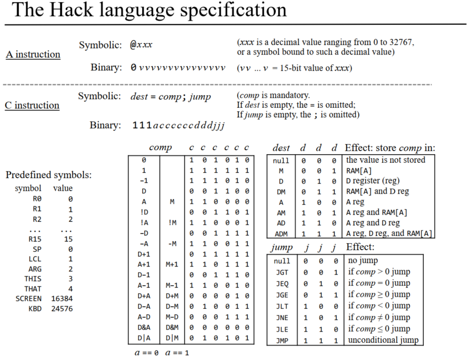

# Nand2Tetris

* [HDL Tips](#hdl-tips)
* [HACK Instruction Set](#hack-instruction-set)
  + [THE ULTIMATE IMAGE](#the-ultimate-image)
  + [A Type Instruction](#a-type-instruction)
  + [C Type Instruction](#c-type-instruction)
* [Registers](#registers)
## About

This is my attempt at Nand2Tetris.

This readme includes some helpful tips and information I wish was presented a little more readily.


## HDL Tips

### Subaddressing must be on the LHS of assignment

```
And16(a[0..7]=somelow, a[8..15]=somehigh, out=out);
```
---

### To use high and low inputs, use true or false

```
Or(a=in, b=true, out=in2);
```
---

### You can make your own HDL chips, the HW sim will find it as long it’s in the same folder.

```
// And4.hdl
CHIP And4 {
 	IN a,b,c,d;
	OUT out;

	PARTS:
	And(a=a, b=b, out=ab);
	And(a=c, b=d, out=cd);
	And(a=ab, b=cd, out=out);
```
---

### You cannot use an external output as an input to another pin, however you can add another output

```
Or(a=a, b=b, out=externalout, out=internalout);
```
---

## HACK Instruction Set

### THE ULTIMATE IMAGE


---

### A Type Instruction

#### Semantics:
Sets A register to the constant

#### Side effects:
- RAM[A] becomes selected RAM register
- ROM[A] becomes selected ROM register

#### Syntax:
@*value* 0vvv vvvv vvvv vvvv
Where *value* is either:
- A constant, or
- A symbol bound to a constant
---

### C Type Instruction

#### Semantics:
Computes the value of comp and stores the result in dest.

If (comp jump 0), jumps to execute ROM[A]

#### Syntax:
_dest_=_comp_;_jump_ (both dest and jump are optional)

where:
- _comp_ = { 0 | 1  | -1 | R | !R | -R | R+1 | R-1 | R1+R2 | R1-R2 | R1&R2 | R1|R2 }
- _dest_ = { null | M | D | DM | A | AM | AD | ADM}
    - (M stands for RAM[A])
- _jump_ = { null | JGT | JEQ | JLT | JNE | JLE | JMP}

and 
- R = { D | A | M }:

## Registers

D, temp register
M, RAM[A], ROM[A]
A, set with @

e.g.
```
@1 //A=1, M=RAM[1]
D=M //D=RAM[1]
M=A //RAM[1]=1
0;JMP // go to ROM[1]
```
